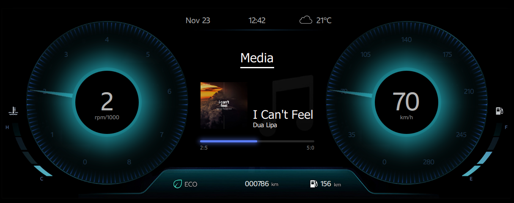
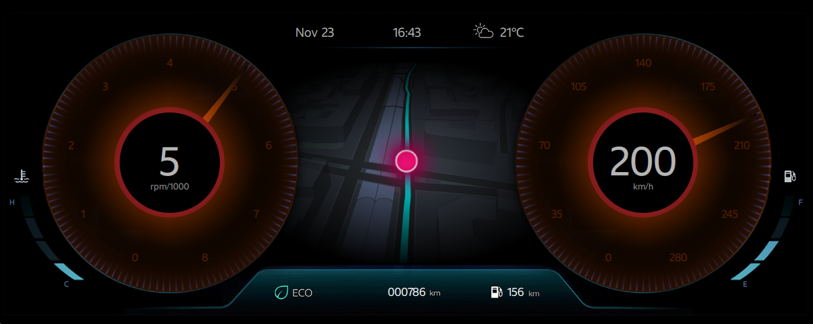
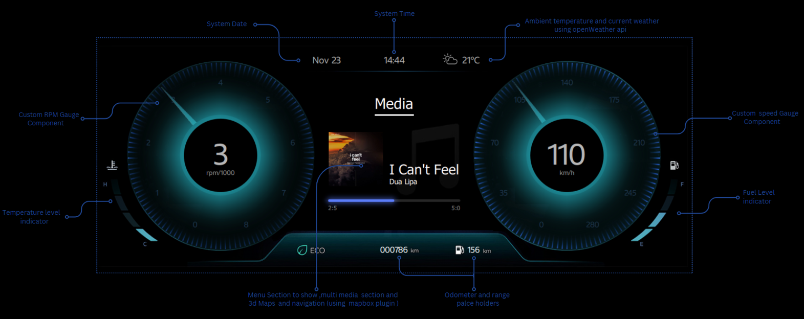

# CarDashHMI Project

## Introduction

 The CarDashHMI project is a sophisticated in-vehicle Human-Machine Interface (HMI) that leverages the power of Qt Quick, offering a rich and stunning user interface. it has been developed with a strong focus on responsiveness, reusability, and customization. It encompasses a variety of components, including speed and RPM gauges, fuel and temperature level indicators, a media player page for simulating track playback, and a map page, all contributing to its comprehensive design.


https://github.com/HaseebTariq1998/CarDashHMI/assets/88825966/6332d9e0-c7ca-49da-9261-b1069570a514

Full video available at: (CarDashHMIDemo)[https://www.youtube.com/watch?v=bJzfTh7QC0A]

## Key Features

- **Responsive Design**: The project's responsive design ensures that UI elements adapt seamlessly to different window sizes. A custom JavaScript class is used to manage dimension adjustments, allowing for a user-friendly experience on various screen size.

- **Component Reusability**: The UI elements are built as reusable Qt components, making it easy to customize and extend the project to meet specific requirements.

- **Immersive 3D Maps**: The project incorporates stunning 3D maps powered by the Mapbox plugin. It includes routing functionality, providing users with interactive and visually captivating mapping features.

- **Ambient Temperature**: Ambient temperature with data fetched from the OpenWeather API, enhancing the experience.

- **Animations**: The project features animations that add a polished touch to the user interface, creating an engaging and visually pleasing dashboard.<br><br><br>

<p align="center">
  
   <figcaption style="text-align: center"> Fig.1 - Cluster in aqua theme.</figcaption>
</p>

<p align="center">
  
   <figcaption style="text-align: center"> Fig.2 - Cluster in red theme (At higher RPM).</figcaption>
</p>
  
<p align="center">
  
   <figcaption style="text-align: center"> Fig.3 - Clsuter Diagram </figcaption>
</p>


## Prerequisites

Before you begin, ensure you have met the following requirements:

- **Qt Version**: This project is developed using Qt 5.15. You need to have Qt 5.15 or a compatible version installed, along with the following Qt modules:

  - Qt Quick
  - Qt Location
  - Qt QML
  - Qt Quick Controls
  - Qt Graphical Effects
  - Qt Positioning
  - Qt Quick Controls Styles
  - Qt Quick Window
  - Qt Network
  - Qt Core
  - Qt Concurrent

  You can download Qt from the [official website](https://www.qt.io/download).

- **C++ Version**: The project requires C++11 or later.

- **Build Tools**: You will need the qmake (3.1 above) and  make utility for building the project.


## Building and Running on Debian-Based Systems

Follow these steps to build and run the project on a Debian-based system (e.g., Ubuntu):

1. **Cloning the Repository**: To clone the Car HMI project repository to your local machine, open your terminal and execute the following command:

    ```bash
    git clone [repository-url] 
    ```

2. **Building the Project** :Before building the project, change the working directory to the project folder. You can build it using the provided .pro file. If you prefer, you can use the Qt Creator IDE or build it manually with the following commands:
    ```bash
    cd CarDashHMI
    mkdir build
    cd build 
    qmake -config release ../CarDashHMI.pro
    make 
    ```
3. **Run the Application** : Execute the compile binary through following command
     ```bash
    ./CarDashHMI
    ```

## Customizing and Extending

The project provides a user interface for car dashboard functionality, including gauges, media playback simulation, and map-related features. Feel free to customize the components to meet your specific requirements and extend the project as needed.

## Contributing

We welcome contributions to this project. You can contribute by creating pull requests or opening issues. Your input and contributions are valuable to me.

## License

This project is licensed under [GPL](LICENSE). Please refer to the LICENSE file for specific licensing details.
